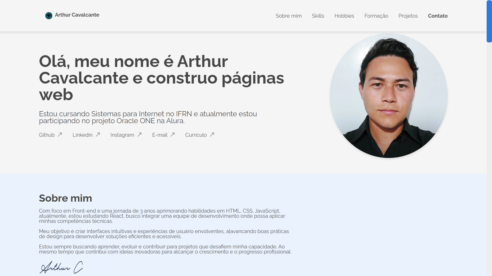

# Portfolio de Arthur Cavalcante
Este é o meu portfolio do desafio challenge, onde compartilha minhas experiências educacionais, projetos profissionais e fornece um formulário de contato para aqueles que desejam entrar em contato com comigo.

## Conteúdo
- Página Inicial: Apresenta informações sobre mim, incluindo minha formação educacional e experiência profissional.
- Projetos Profissionais: Exibe alguns dos projetos profissionais meus com imagens, descrições e links para repositórios e demonstrações.
- Contato: Um formulário de contato para os interessados em entrar em contato com comigo.

### 🔗 Links Úteis
- GitHub: [@Thurcavalcante](https://github.com/Thurcavalcante)
- Linkedin: [Arthur Cavalcante](https://www.linkedin.com/in/thur-cavalcante/)
- Deploy: [Portfólio](https://thurcavalcante.github.io/challenge-portfolio/)

### 📦 Tecnologias usadas
* [HTML](https://developer.mozilla.org/pt-BR/docs/Web/HTML)
* [CSS](https://developer.mozilla.org/pt-BR/docs/Web/CSS)
* [JavaScript](https://developer.mozilla.org/pt-BR/docs/Web/JavaScript)

Para mais informações ou para entrar em contato comigo, sinta-se à vontade para visitar meu perfil no GitHub ou acessar o link do portfolio acima.

Desenvolvido por [Arthur Cavalcante](https://github.com/Thurcavalcante) em 2024.
